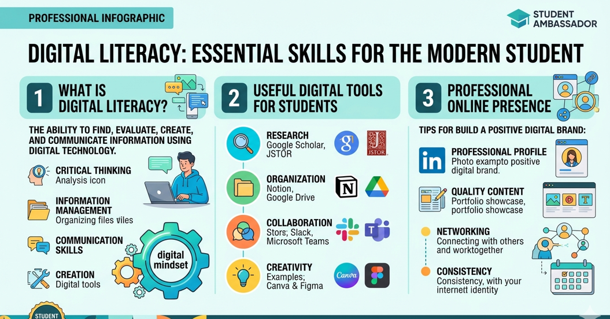

# Task 1: Digital Literacy Infographic

## Tool Used:
I used Canva to create my infographic.

## Description:
For this task, I designed an infographic to explain what digital literacy means and why it is important for students like us. In my design, I included topics such as safe internet usage, useful digital tools, and how to maintain a professional online presence.

While making this infographic, I tried to keep the content simple and easy to understand so that anyone can quickly learn from it. It also helped me understand how important it is to use digital platforms responsibly.

## Screenshot:
